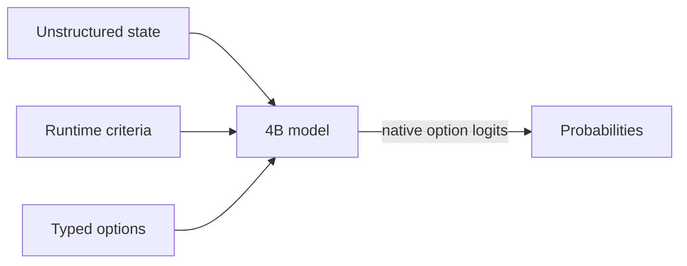

# SemIf (formerly OpenJev)

## This fork: image input and a real-time per-frame pipeline

This fork adds vision to SemIf without changing the model or the readout. The same
frozen Qwen3.5-4B checkpoint is loaded with its vision tower, an image goes into the
user turn ahead of SemIf's JSON payload, and the same option-letter logits are read at
the last position. Nothing is trained. Everything lives in [`vision/`](vision/README.md);
the shipped text paths, benchmarks, and published results below are unchanged and the
repo's own checks still pass. Target platform: Linux, one sm_120 GPU (RTX PRO 6000 /
RTX 50xx), the repo's pinned torch 2.10 and transformers 5.17.

**What was added**

- A per-frame pipeline: vision encoder once, then one captured CUDA graph that prefills
  the image prefix, replicates the cache to N branches, and scores N criteria as short
  suffixes. Each branch sees only its own criterion.
- A cached static text block before the image (rules, a state schema): prefilled once,
  its linear-attention state and KV copied per frame, so 2000 tokens of context cost
  about 5 ms per frame instead of 90.
- FlashAttention-4 on consumer Blackwell: a runtime fix for its sm_120 tile config at
  head_dim 256, plus a build script and prebuilt wheel for `causal-conv1d` on CUDA 13
  systems.
- A prompt-format experiment on the repo's own fixtures with the repo's evaluator, and a
  synthetic-image probe (8/8).

**Results** (one RTX PRO 6000, 640x480 frames, compact format, warm, GPU otherwise idle)

| Decisions per frame | 1 | 8 | 16 | 32 | 64 |
|---|---:|---:|---:|---:|---:|
| Per frame | 46 ms | 63 ms | 82 ms | 124 ms | 214 ms |

| Cached static context before the image, 16 decisions | 0 tokens | 520 | 2010 |
|---|---:|---:|---:|
| Per frame (FA4) | 86 ms | 89 ms | 94 ms |
| Same, recomputing the prefix every frame | 86 ms | 108 ms | 174 ms |

Shared-prefix and graph outputs match independent full forwards with a worst
probability gap of 0.02 to 0.03 and 16/16 argmax agreement. Decisions per frame are a
token budget: about 45 ms fixed, then roughly 2.6 ms per decision at the padded suffix
width; around 20 decisions fit under 100 ms.

The format experiment replaced SemIf's per-option `{"letter", "description"}` objects
with an `{"A": ..., "B": ...}` map ("compact"). Same system prompt, same readout:

| Fixture, mean family balanced accuracy | json (shipped) | compact | plain text |
|---|---:|---:|---:|
| Authored 144 | 0.813 | **0.904** (+0.091, CI [+0.058, +0.134]) | 0.871 |
| Perturbations 108 | 0.766 | **0.830** (+0.064, CI [+0.010, +0.125]) | 0.816 |
| WANLI 256 | 0.625 | 0.648 | **0.679** (+0.055, CI [+0.005, +0.105]) |

The shipped format reproduces the published 0.8132 exactly on this hardware. Compact is
shorter (a yes/no suffix is 40 tokens instead of 54) and is the recommended format in
`vision/`; the published claims below are about the shipped format and are left as is.

**What is not established.** Every number above is latency or a text fixture. No
accuracy on real video frames has been measured; the probe images are trivially easy.
Probabilities are option scores, not calibrated confidences. See
[`vision/README.md`](vision/README.md) for setup, the quick start, and caveats.

<div align="center">

**Semantic ifs from open models, on a 3090 at home.**

*Independent project; not affiliated with Jev or TypeSafe.*

**Wow! No waitlist.** [Run it in your browser today.](webgpu-demo/index.html)

[](demo/index.html)

*Same frozen 4B model · same state · same 21 questions · measured separately, aligned at t=0 in the replay*

</div>

> **Independent research project.** SemIf was formerly called OpenJev. It is not affiliated with or endorsed by TypeSafe. Jev, TypeSafe, and other names and marks are the property of their respective owners. No infringement is intended.


Most agent decisions are small: *route this*, *retry that*, *does the evidence support X?* A chat model can answer them, but it spends time generating text that software immediately parses back into an `if` statement.

Jev is TypeSafe's closed service for runtime-defined semantic decisions. This project reproduces that **interface pattern** with open models; it does not reproduce Jev's undisclosed model or training.

This baseline reads typed option probabilities directly from a model. No answer sentence, JSON repair, or decoding loop.

### Latest changes — 2026-09-18

- Added MiniCPM5 2B and Qwen3.5 4B to the browser demo.
- Added **Unsloppify site**, a switch to a conventional interface.

## Quick start

**Apple Silicon:** use the native [MLX backend](docs/MLX.md) for direct scoring,
serial prefix reuse, and parallel shared-state decisions on macOS arm64.
Install `pip install -e '.[test,mlx]'` and add `--backend mlx` to the scorer command.

Python 3.10+, CUDA, and a GPU that can hold a 4B BF16 model:

```bash
python -m venv .venv
. .venv/bin/activate
export HF_HOME=/path/to/large-drive/huggingface
pip install -e '.[test]'
```

Run the owned examples:

```bash
CUDA_VISIBLE_DEVICES=0 semif-score \
  --mode direct \
  --model Qwen/Qwen3.5-4B \
  --revision 851bf6e806efd8d0a36b00ddf55e13ccb7b8cd0a \
  --input examples/decisions.jsonl \
  --output results.jsonl
```

Each result contains typed option scores, timing, the exact model revision, and a prompt hash.

If every row has the same exact state, switch to `--mode shared` to prefill it once and evaluate the criteria in parallel.

## How it works



- **Runtime-defined:** criteria and option descriptions arrive with the request.
- **Decision-native:** one forward pass reads declared option logits; no answer token is sampled.
- **Shared-state aware:** one long state can be prefetched once, then branched across many criteria.
- **Auditable:** the owned fixture, exact runners, row-level outputs, revisions, prompts, and known failures are committed.

## Speed

### Decisions versus a compact generated array

Same frozen Qwen3.5-4B, same owned state, same 21 binary criteria, one RTX 3090:

| Output path | Time | Output tokens | Result |
|---|---:|---:|---|
| Direct typed logits, median of 3 | **1.023 s** | **0** | 21 probability pairs |
| Autoregressive JSON array, median of 3 | 5.332 s | 111 | Valid ordered 21-value array |

The compact generative baseline emits only ordered `"yes"`/`"no"` values—no keys, confidence objects, or explanations. Its median first-token time was 0.489 s, but completing the array took **5.21×** as long as direct readout. All three arrays were valid and identical. Their choices agreed with direct argmax on 18/21 criteria, so this is a systems comparison rather than a claim that the two readouts are semantically equivalent. [Exact prompt, outputs, token timeline, and runs](results/raw/decision-vs-compact-array.json) are committed.

### Reusing a state across 21 decisions

On an owned 37-state × 21-criterion workload:

| Execution path | Decisions/s | 777 decisions |
|---|---:|---:|
| Fresh direct scoring | 2.33 | 333.1 s |
| Serial prefix reuse | 10.75 | 72.3 s |
| Parallel suffixes | **20.03** | **38.8 s** |
| Native reranker | 1.86 | 417.3 s |

The owned [37×21 fixture](benchmarks/data/shape777.jsonl), [direct/reuse runner](benchmarks/shape777.py), [reranker runner](benchmarks/shape777_reranker.py), [raw timings](results/raw/shape777-direct.json), and [row-level predictions](results/raw/shape777-direct.predictions.jsonl) are included. The fast reuse paths are experimental: BF16 execution changed 5–6 of 777 argmaxes relative to fresh scoring.

## Quality

### Browser model ladder

| System | Browser artifact | Download | Authored balanced accuracy | Perturbation balanced accuracy | TypeSafe subset agreement |
|---|---|---:|---:|---:|---:|
| Qwen3-0.6B | Q8_0 | 639 MB | 0.440 | 0.528 | 0.407 |
| MiniCPM5-2B | Q4_K_M | 1.56 GB | 0.686 | 0.693 | 0.637 |
| **Qwen3.5-4B** | Q4_K_M | 3.01 GB | **0.813** | **0.766** | 0.845 |
| Published Jev | Closed hosted service | — | — | — | **0.883** |

*Native BF16 scores. Browser builds use quantized GGUF. Jev is TypeSafe's published result on the same 102-row subset.*

### General decision baseline

| Frozen workload | Rows | Direct logits (4B) | Native reranker (4B) | Published Jev |
|---|---:|---:|---:|---:|
| Authored decisions, balanced accuracy | 144 | **0.813** | 0.625 | — |
| WANLI, balanced accuracy | 256 | **0.637** | 0.522 | — |
| TypeSafe selected subset, modal agreement | 102 across 20 cases | **0.845** | 0.560 | 0.883 |
| Every judgment grid, accuracy | 36 | **0.806** | 0.694 | — |
| Every action firewall, composed accuracy | 10 actions | 0.700 | 0.700 | — |
| Every code retrieval, Recall@1 | 6 queries | 1.000 | 1.000 | — |
| Every company knowledge, Recall@1 | 7 queries | 0.929 | 0.929 | — |

The reranker remained strong at retrieval ranking, but direct logits were the better general-decision baseline.

The Jev number is read from TypeSafe's published records; we did not run a live Jev endpoint. The comparison covers the 102 rows that could be aligned from public artifacts, not TypeSafe's reported 711-row aggregate.

## Input

```json
{
  "id": "route-1",
  "state": "Customer cannot access an account after a password reset.",
  "question": "Which queue should handle this request?",
  "options": [
    {"id": "access", "description": "Account access support."},
    {"id": "billing", "description": "Billing support."}
  ]
}
```

Returned probabilities are conditional on the supplied options. Calibrate and validate them on the workload where they will make decisions.
`state` may also be a nonempty JSON object or array. Direct modes preserve it as structured JSON; reranker mode renders it as document text.

## Documentation

- [Results](docs/RESULTS.md) — quality, speed, perturbations, and claim boundaries
- [Method](docs/METHOD.md) — frozen prompts, metrics, and timing scope
- [Reproduce](docs/REPRODUCE.md) — exact environment, pinned commands, perturbations, and verification
- [Interactive replay](demo/index.html)
- [Browser-only WebGPU demo](webgpu-demo/index.html) — no waitlist; use it today
- [Machine-readable summary](results/phase1-summary.json)
- [Benchmark bundle](benchmarks/README.md) — fixtures, runners, selection IDs, and reproduction commands
- [Raw results and checksums](results/raw/)
- [Third-party sources](THIRD_PARTY.md)

## Star history

[](https://www.star-history.com/#TheoLeeCJ/SemIf&Date)

## Evaluation sources

- [TypeSafe public evaluations](https://evals.typesafe.ai/) — public comparison cases used for selected-subset agreement
- [Every parallel judgment lab](https://typesafe-parallel-judgment-lab.every-4573.chatgpt.site/) and its [downloadable experiment data](https://typesafe-parallel-judgment-lab.every-4573.chatgpt.site/downloads/experiments.json)
- [WANLI](https://huggingface.co/datasets/alisawuffles/WANLI) — external natural-language inference check
- [Qwen3-0.6B](https://huggingface.co/Qwen/Qwen3-0.6B), [MiniCPM5-2B](https://huggingface.co/openbmb/MiniCPM5-2B), [Qwen3.5-4B](https://huggingface.co/Qwen/Qwen3.5-4B), and [Qwen3-Reranker-4B](https://huggingface.co/Qwen/Qwen3-Reranker-4B) — frozen baseline models

Model weights and third-party source records are not included. Upstream models retain their licenses. Project code is released under the [MIT License](LICENSE).
